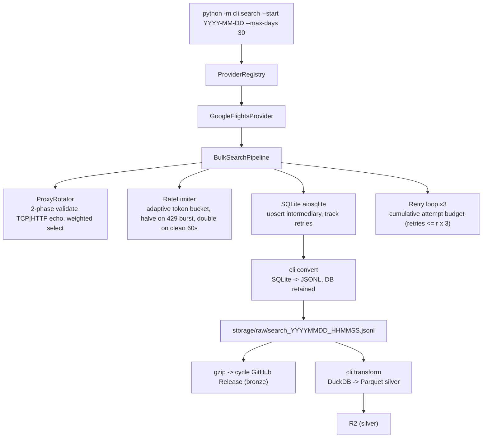

# Flight Price Observatory

Auto-collect, store, analyse historical airfare data. SIN -> 15 Asian destinations. Build longitudinal dataset for trend analysis + ML.

Unlike normal flight search (show current price), this snapshots prices over time -> spot patterns across booking windows, seasons, airlines, routes.

## Table of Contents

- [Objectives](#objectives)
- [System Architecture](#system-architecture)
- [Technology Stack](#technology-stack)
- [Project Structure](#project-structure)
- [Getting Started](#getting-started)
- [Installation](#installation)
- [Running Locally](#running-locally)
- [Roadmap](#roadmap)
- [Contributing](#contributing)
- [License](#license)

## Objectives

**Build historical airfare dataset.** Automated pipeline, periodic snapshots, growing dataset for long-term analysis.

**Scalable pipeline.** Modular ingestion + validation + storage. Modern data engineering.

**Cloud data lake.** Raw bundles in GitHub Releases (bronze), processed Parquet in Cloudflare R2 (silver). Immutable, queryable, versioned.

**Exploratory analysis.** Price trends, seasonal patterns, airline comparison, booking window behaviour.

**Predictive analytics.** Prep for ML: price forecasting, anomaly detection, booking recommendations.

**Extensible design.** Provider-agnostic. Add routes, providers, analytics without rewiring core.

## System Architecture

Six layers:

**Scheduler.** GitHub Actions cron, 4-day cycle at 05:30 SGT (see [ADR-0006](docs/decisions/0006-scheduling.md)). No manual intervention.

**Data collection.** Provider abstraction layer. Each provider implements `BaseProvider` interface. Currently: `GoogleFlightsProvider` (SIN->KUL/CGK/BKK/HKT/DPS/MNL/SGN/HAN/NRT/KIX/HND/PVG/PEK/ICN/PUS). Swap or add providers without touching pipeline.

**Routes.** `RouteCatalog` (`collector/routes.py`) defines 15 destinations out of SIN. Each date in the search window generates 30 one-way tasks (SIN->dest and dest->SIN) plus 3 round-trip tasks per SIN-origin route (return offsets 7, 14, 21 days) — 75 searches per route/date, 20,325 per full 271-day window.

> **Midnight caveat.** Runs crossing midnight keep only future dates after rollover: a run started 23:50 builds today's tasks, which become invalid at 00:00 and fail as `DATA` (no proxy blame); any rebuild after rollover skips past dates entirely. Past dates are unsearchable by definition — losing up to a day at the boundary is by design.



Details: [docs/architecture.md](docs/architecture.md), [docs/design.md](docs/design.md), [docs/data-model.md](docs/data-model.md).

**Validation + transformation.** Schema validation, type checking, dedup, normalisation, enrichment. Separate raw from processed.

**Data lake.** Bronze: one GitHub Release per cycle (`bronze-YYYYMMDD`, tag `cycle-YYYYMMDD`) carrying the gzipped JSONL bundle from each of the 4 runs. Silver: Parquet (Hive-partitioned by route) uploaded to R2. Gold (aggregated analytics) later. Immutable raw tier enables reprocessing.

**Analytics.** DuckDB SQL queries against Parquet. Route comparisons, seasonal trends, booking window analysis.

**Presentation.** (Future) Dashboard -- Streamlit + Plotly. Decoupled from pipeline. Consumes processed datasets only.

## Technology Stack

| Component       | Technology        | Why                                         |
|-----------------|-------------------|---------------------------------------------|
| Language        | Python 3.14+      | One language, entire stack                  |
| HTTP            | curl_cffi         | TLS fingerprint spoofing, browser impersonation |
| Proxy fetch     | httpx             | Pull proxy lists from 15 high-yield sources |
| SQLite          | aiosqlite         | Async intermediary storage, upsert + retry  |
| Flights API     | fli               | Google Flights internal API wrapper         |
| Progress        | log lines         | Periodic %/rate/ETA progress in logs       |
| Scheduler       | GitHub Actions    | Cron, no infra                              |
| Package mgmt    | uv                | Fast, reproducible                          |
| Testing         | pytest + ruff + basedpyright + coverage | 338 tests, 97% cov |
| Storage         | Cloudflare R2     | S3-compatible, free 10 GB, pay after        |
| Query           | DuckDB            | SQL over Parquet, no server                 |
| Viz             | Streamlit + Plotly| (Future) interactive dashboard              |

> **Note:** `fli` v0.9.0 has a parser bug ([#223](https://github.com/punitarani/fli/issues/223)) causing zero flights on routes with accented characters. Pinned to [PR #224 branch](https://github.com/punitarani/fli/pull/224). Monitor upstream for merge — switch back to PyPI release when available.

## Project Structure

```
flight-price-observatory/
+-- .github/
|   +-- workflows/          # ci.yml (lint + test), collect.yml (scheduled collection)
+-- cli/                    # CLI entry points (search, convert, transform, publish)
+-- collector/              # core package: providers, services, models
|   +-- providers/          #   one dir per flight data source (BaseProvider)
|   +-- services/           #   pipeline + rate limiter
|   +-- models/             #   domain objects
+-- storage/                # runtime data (gitignored outputs)
|   +-- raw/                #   final JSONL
|   +-- db/                 #   transient SQLite state
|   +-- logs/               #   run logs (gitignored)
|   +-- proxy_cache.json    #   proxy pool cache (gitignored)
+-- docs/                   # architecture, design, data model, ADRs
+-- tests/                  # mirrors collector/ module structure
|   +-- libs/               #   factories + fakes (shared test helpers)
+-- pyproject.toml
+-- README.md
```

### cli/

CLI commands. `__main__.py` dispatches via argparse subparsers. Add commands by adding module + registering subparser.

### collector/

Core collection logic. Provider-agnostic pipeline. New provider = new file under `providers/` implementing `BaseProvider`.

### storage/

`raw/` -- final JSONL output. `db/` -- SQLite search state (always kept; retries/`--continue` read it). `silver/` -- Parquet output of `cli transform`.

## Getting Started

### Prerequisites

- Python 3.14+
- Git
- uv

```
git clone https://github.com/notlega/flight-price-observatory.git
cd flight-price-observatory
uv sync
```

No env vars needed for local collection. R2 upload requires credentials when configured.

## Installation

```
uv sync
```

## Running Locally

```
# Search next 270 days
uv run python -m cli search

# Custom window
uv run python -m cli search --start 2026-07-11 --max-days 90

# Currency + rate/concurrency tuning
uv run python -m cli search --currency USD --rate 5 --workers 10

# Verbose debug (global flag, before or after subcommand)
uv run python -m cli -v search
uv run python -m cli search --verbose

# Convert existing SQLite state to JSONL (DB is always kept)
uv run python -m cli convert

# Convert a specific state file
uv run python -m cli convert storage/db/search_state.db --output /tmp/out.jsonl

# Transform raw JSONL to Parquet (silver), Hive-partitioned by route
uv run python -m cli transform --input storage/raw/search_20260817_040546.jsonl

# Publish silver to Cloudflare R2 (env: R2_ACCOUNT_ID, R2_ACCESS_KEY_ID,
# R2_SECRET_ACCESS_KEY, R2_BUCKET)
uv run python -m cli publish

# Run tests + lint
uv run pytest
uv run lint
```

`search` flags:

| Flag        | Default | Description          |
|-------------|---------|----------------------|
| `--start`   | today   | Start date (YYYY-MM-DD) |
| `--max-days`| 270     | Days ahead from start |
| `--currency`| SGD     | Currency code for pricing |
| `--rate`    | 200     | Requests per second  |
| `--workers` | 50     | Max concurrent searches |
| `--continue`| False   | Retry only failed tasks from the existing DB (`--start`/`--max-days` ignored) |
| `-v`        | False   | Debug logging (global, also after subcommand) |

`convert` flags:

| Flag        | Default | Description          |
|-------------|---------|----------------------|
| `db` (positional) | `storage/db/search_state.db` | SQLite state file |
| `--output`  | auto    | Output JSONL path (`storage/raw/search_YYYYMMDD_HHMMSS.jsonl`) |

`transform` flags:

| Flag        | Default | Description          |
|-------------|---------|----------------------|
| `--input`   | latest `storage/raw/search_*.jsonl` | Raw JSONL path |
| `--output`  | `storage/silver/<timestamp>` | Parquet output directory |

`publish` flags:

| Flag        | Default | Description          |
|-------------|---------|----------------------|
| `--input`   | `storage/silver` | Parquet directory to upload |

## Roadmap

- [x] Provider abstraction layer ([@notlega](https://github.com/notlega))
- [x] Automated data collection with proxy rotation ([@notlega](https://github.com/notlega))
- [x] SQLite intermediary + retry loop ([@notlega](https://github.com/notlega))
- [x] Google Flights provider (15 SIN<->Asia routes) ([@notlega](https://github.com/notlega))
- [x] Adaptive collection schedule (4-day cycle: full 0-270d, then 0-30d/0-60d/0-90d — see ADR-0006) ([@notlega](https://github.com/notlega))
- [x] Bronze bundles in GitHub Releases (gzip) + R2 upload of silver Parquet ([@notlega](https://github.com/notlega))
- [x] Bronze->silver Parquet transformation (DuckDB) ([@notlega](https://github.com/notlega))
- [ ] DuckDB analytical queries ([@josephyqf](https://github.com/josephyqf))
- [ ] Interactive dashboard ([@josephyqf](https://github.com/josephyqf))
- [ ] Price forecasting ML models ([@josephyqf](https://github.com/josephyqf))
- [ ] Additional providers ([@notlega](https://github.com/notlega))

## Contributing

1. Open issue proposing change
2. Discuss architecture changes before code
3. Feature branch from main
4. `uv run pytest` pass before PR
5. Match code style (ruff)
6. ADR in `docs/decisions/` for major decisions

## License

See `LICENSE` file. Contributors agree to same terms.
