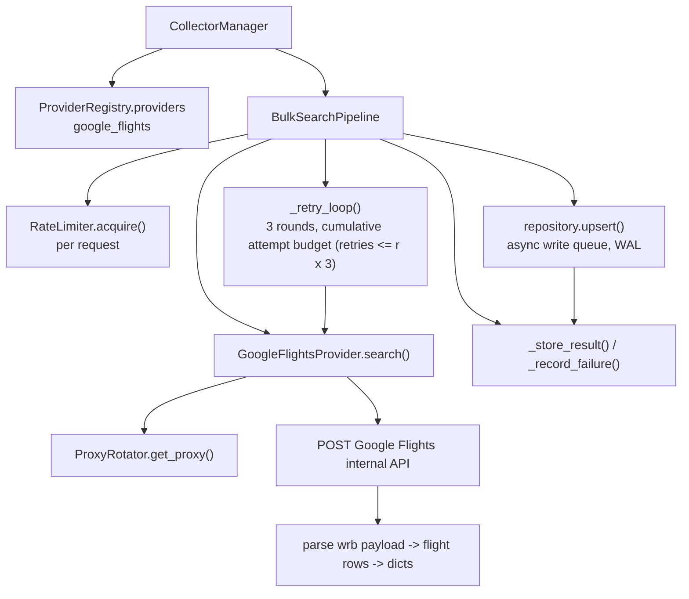
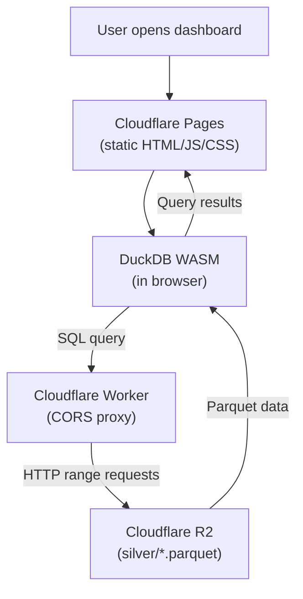

# Architecture

## Layers

Six layers, one Python codebase.

| Layer | Responsibility | Implementation |
|-------|----------------|----------------|
| Scheduler | Periodic trigger | GitHub Actions cron, 4-day cycle 05:30 SGT (ADR-0006) |
| Collection | Provider-agnostic search | `BulkSearchPipeline` |
| Validation/transformation | Schema, dedup, normalise | `collector/convert.py` |
| Data lake | Raw bundles + processed tier | bronze: GitHub Releases; silver: R2 Parquet |
| Analytics | SQL over Parquet | DuckDB |
| Presentation | Interactive dashboard | DuckDB WASM + Cloudflare Pages + Worker proxy |

## Collection pipeline

Entry point: `python -m cli search` -> `cli/search.py` -> `CollectorManager` -> `BulkSearchPipeline`.

### Provider flow

1. `BulkSearchPipeline.run()` enumerates `[start_date, start_date+max_days_ahead]`.
2. Each date is a route task: `origin -> dest` for every provider route.
3. `_run_batch()` fans out tasks with `asyncio.Semaphore(max_concurrent)`, each worker loops over its assigned `(route, date)` pairs.
4. `_attempt_once()`:
   - rate-limit acquire,
   - pick proxy (`_get_provider_map` -> `rotator.get_proxy()`; empty -> `_auto_refresh`),
   - `provider.search(...)`, map exceptions to `AttemptResult`.
5. Success -> `_store_result()` -> `repository.upsert()`. Failure -> `_record_failure()` stores the attempt count (1-based, up to 3 per round).
6. `_retry_loop(3)` re-runs failures, distributing them round-robin across providers. Round *r* selects rows with `retries <= r * 3` (see [design.md](design.md#retry-semantics)); routes no provider covers are skipped with a WARNING.
7. The run ends with the SQLite state file retained. JSONL export is a separate explicit step: `cli convert storage/db/search_state.db`. The DB is the operational source of truth (retry state, `--continue`); JSONL is the raw archive. See [ADR-0006](decisions/0006-scheduling.md) for how the scheduled workflow chains search -> convert -> gzip/release -> transform -> R2.

### Rate limiting

Adaptive token bucket (`collector/services/rate_limiter.py`):

- `acquire()` waits until `now - last_request >= 1/rate`.
- `report_429()` halves the rate (min 0.5/s) when a 429 burst exceeds 20% of the expected rate in a 30s window.
- `report_success()` doubles it back, but only after a clean 60s window.
- `__init__` validates config: `max_rate`/`min_rate` must be positive and `min_rate <= max_rate`, else `ValueError`. Zero `max_concurrent` is clamped to 1 worker.

### Proxy rotation (`collector/proxy.py`)

- 2-phase validation: TCP prefilter -> HTTP echo latency (concurrent).
- Quality score = f(latency), proxies weighted by score, dead ones removed.
- Sources fetched from 27 list endpoints; results cached to `storage/proxy_cache.json` (fresh 30 min, revalidated up to 24 h).
- `refresh()` uses cache when fresh; revalidates stale cache up to 24 h; fetches fresh when cache missing, expired, or all cached proxies dead.
- **Eviction & blacklist:** a proxy blacklisted after 3×429 (30 min) or one dead-proxy failure (10 min) is excluded from cache re-population; cache-fresh path only adopts the cached pool if it has more *usable* proxies than the live pool (never clobbers live survivors).
- **Refill:** auto-refresh throttled to one attempt / 5 s — the gap is bypassed while the pool is starved (< `_REFILL_THRESHOLD` usable), so a dead pool refills back-to-back instead of idling 5 minutes. Empty pool (0 usable) force-refetches after 60 s; low-but-nonempty pool after 30 min.
- **Usable vs working:** "usable" excludes rate-limit-parked proxies, so an all-parked pool triggers fast refill instead of blocking on the 30-min cooldown.

## Persistence

- Intermediary: SQLite via `aiosqlite`, WAL journal, async write queue with batching, flush/stop sentinels.
- `open()` validates the file with a synchronous `sqlite3` probe before spawning the aiosqlite worker thread — corrupt/unreadable DB fails fast (`DatabaseError`) instead of leaking the worker thread.
- `flush()`/`close()` await the writer only after the batch is committed (`task_done()` fires post-commit), so callers never read pre-commit state.
- Final: JSONL in `storage/raw/`, one line per successful route search. Flights embedded as JSON string. The SQLite DB is retained (retry state, `--continue`); `cli convert` exports it on demand and never deletes it.

See [data-model.md](data-model.md).

## Dashboard architecture

**Stack:** DuckDB WASM (browser) + Cloudflare Pages (static) + Cloudflare Worker (CORS proxy)

**Data flow:**

**Why:**

- Zero infrastructure cost (Cloudflare free tier)
- R2 stays private (Worker proxy handles auth + CORS)
- Scales to unlimited users (browser compute)
- Always fresh data (queries R2 directly)
- Partitioned by route → fast queries for specific origin/destination

**Setup required:**

- R2 custom domain (already exists)
- CORS policy on R2 bucket
- Cloudflare Worker deployment
- Dashboard directory (handled by other developer)

## Design decisions

- ADR-0001 Cloudflare R2 as lake tier
- ADR-0002 Parquet for processed tier
- ADR-0003 provider abstraction
- ADR-0004 proxy reliability hardening
- ADR-0005 pipeline hardening (retries, CLI, persistence)
- ADR-0006 scheduling and storage (4-day cycle, bronze releases, silver R2, CLI model)

Full records: [docs/decisions/](decisions/)
